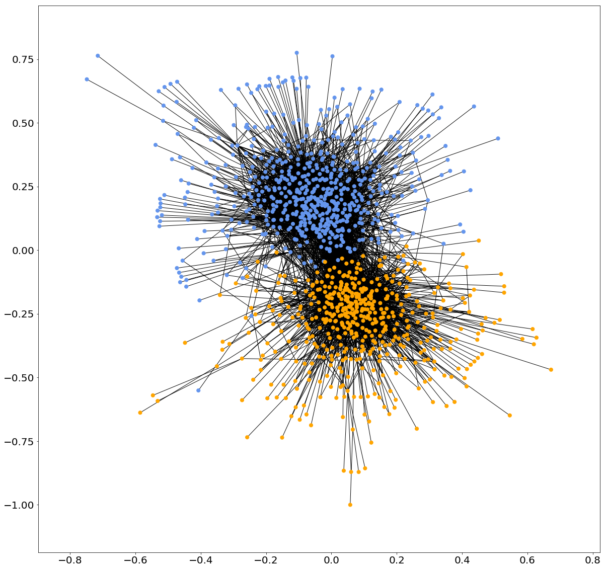

# Regularised Spectral Clustering

Python code for reproducing the results of the NIPS 2018 paper [Understanding Regularized Spectral Clustering via Graph Conductance](https://arxiv.org/abs/1805.00676).

